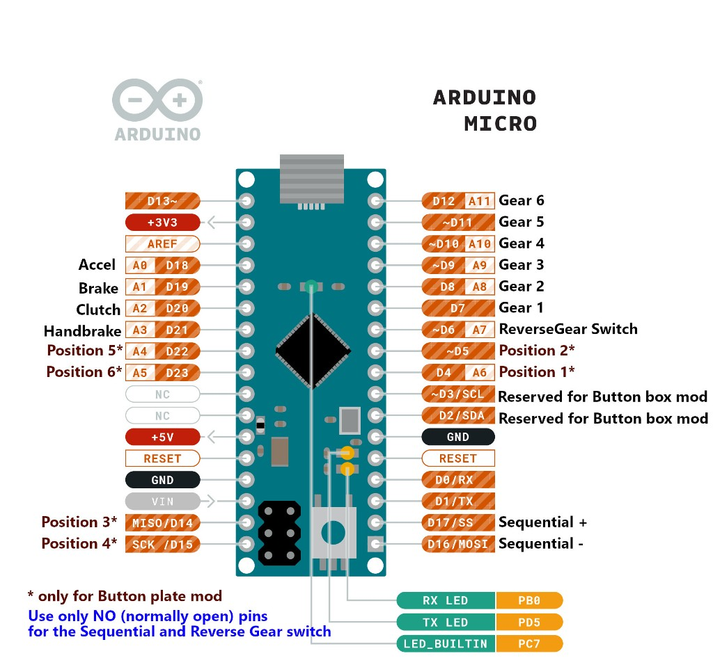
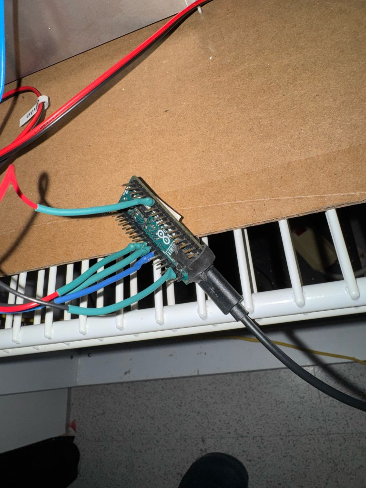
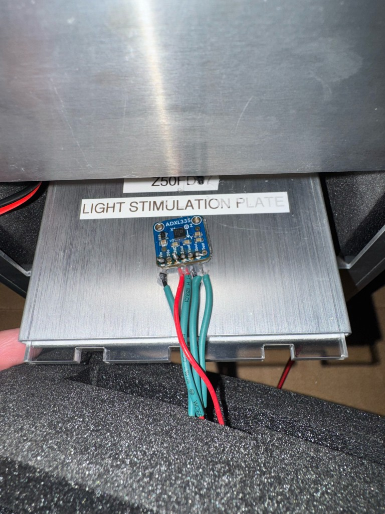

# Acceleration Logger GUI

A desktop Tkinter GUI for logging Arduino accelerometer-style analog streams to CSV with run metadata, file rotation, and manifest tracking.

## Features

- Metadata-driven logging UI (platform, temperature, speed, duration) with live preview and run stats.
- Auto-detects common Arduino serial ports and logs at 115200 baud.
- Rotating CSV output with manifest tracking; optional gzip compression and temperature schedule support.

## Data Format and Output

- Serial input format: `x,y,z` integers.
- Output folder: `~/Desktop/ARDUINO_AcclLogs/<run_id>/`.
- Each run writes rotated CSV part files plus a `manifest.json` containing metadata, checksums, and events.

## Requirements

- Python 3.10+
- `pyserial>=3.5`
- Arduino-compatible board streaming CSV analog values

Install dependencies:

```bash
python -m pip install -r requirements.txt
```

## Arduino Firmware

1. Open `firmware/ACCL_logger_Arduino.ino` in Arduino IDE.
2. Upload to your board.
3. Confirm it streams comma-separated values at 115200 baud.

## Installing / Updating on Windows (GitHub Desktop)

1. Install GitHub Desktop and sign in.
2. In GitHub Desktop, clone this repository to your laptop.
3. Open a PowerShell terminal in the repo folder.
4. Install dependencies:
   - `py -m pip install -r requirements.txt`
   - `py -m pip install pyinstaller`
5. Build the app:
   - `.\scripts\build-windows.ps1`
6. Run the generated versioned executable from `dist/` (for example `AccelerationLoggerGUI-<version>.exe`).

To update later:
1. In GitHub Desktop, click `Fetch origin` then `Pull origin`.
2. Re-run `.\scripts\build-windows.ps1`.
3. Launch the newest versioned executable in `dist/`.

## Installing / Updating on macOS

1. Clone this repository to your Mac (GitHub Desktop or `git clone`).
2. Open Terminal in the repo folder.
3. Install dependencies:
   - `python -m pip install -r requirements.txt`
   - `python -m pip install pyinstaller`
4. Build the app bundle:
   - `./scripts/build-macos.sh`
5. Open the generated versioned app in `dist/` (for example `AccelerationLoggerGUI-<version>.app`).

To update later:
1. Pull the latest repository changes.
2. Re-run `./scripts/build-macos.sh`.
3. Open the newest versioned app in `dist/`.

## Hardware Notes

- Default port detection matches common Arduino/CH340 descriptors and VID/PID hints.
- Ensure your board is connected and readable before starting a long run.
- Hardware used: Arduino Micro + ADXL335 accelerometer.
- Reference publication: see [1].

### Arduino Micro + ADXL335 Rig (Quick Wiring)

- Pin connections used in this setup:
  - `ADXL335 Vin` -> `Arduino Micro +3V3`
  - `ADXL335 GND` -> `Arduino Micro GND`
  - `ADXL335 Xout` -> `Arduino Micro A5` (`ap1` in firmware)
  - `ADXL335 Yout` -> `Arduino Micro A4` (`ap2` in firmware)
  - `ADXL335 Zout` -> `Arduino Micro A3` (`ap3` in firmware)
- Keep wiring short/secure and mechanically anchor both boards so vibration does not introduce intermittent electrical contact.
- The ADXL335 was mounted using 3M `300LSE` double-sided tape for secure attachment to the test surface.
- Leave optional breakout pins (for example, self-test) disconnected during standard logging unless your board documentation says otherwise.
- Validate setup before long runs by checking that serial output remains stable at rest and changes predictably when each axis is tilted.
- The current firmware defines the analog input mapping in `ap1`, `ap2`, and `ap3` inside `firmware/ACCL_logger_Arduino.ino`; adjust those constants if you rewire.

Arduino Micro pin schema:



Reference setup photos:




## References

1. Titos I, Juginovic A, Vaccaro A, Nambara K, Gorelik P, Mazor O, Rogulja D. A gut-secreted peptide suppresses arousability from sleep. Cell. 2023 Mar 30;186(7):1382-1397.e21. doi:10.1016/j.cell.2023.02.022. PMID:36958331. https://www.sciencedirect.com/science/article/pii/S0092867423001654?via%3Dihub

## Contributing

Contributions are welcome. Please:

1. Open an issue describing the bug or feature request.
2. Keep pull requests focused and small.
3. Include clear reproduction steps for bug fixes.

## Reporting Issues

When filing an issue, include:

- OS and Python version
- Board model and serial adapter type (if known)
- A sample of serial output
- Steps to reproduce and expected vs actual behavior

## License

This project is licensed under the MIT License. See `LICENSE`.
